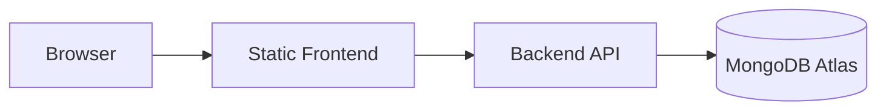

# Dog Mitra

## Purpose

Dog Mitra is a veterinary clinic platform for clinic operations, customer interaction, appointments, and public content.

## Scope

This repository currently contains:

- A static frontend MVP in the repository root
- A production backend in `backend/`
- Architecture documentation in `architecture/`

## High-Level Architecture



## Technology Stack

- HTML, CSS, and vanilla JavaScript for the current frontend MVP
- Node.js and Express for the backend
- MongoDB Atlas and Mongoose for persistence
- JWT for authentication
- Render for deployment

## Repository Structure

```text
Dog-Mitra/
|-- README.md
|-- architecture/
|-- backend/
`-- frontend/ (documentation placeholder only; source folder not present)
```

## Quick Start

### Frontend

Open the root `index.html` file in a browser.

### Backend

```bash
cd backend
npm install
npm start
```

## Documentation Links

- [Architecture documentation](./architecture/README.md)
- [Backend documentation](./backend/README.md)
- [Frontend documentation](./frontend/README.md)

## Related Notes

- The repository currently does not contain a dedicated `frontend/` source folder.
- Frontend documentation is therefore a placeholder structure for future expansion.

## Last Updated

2026-07-09

