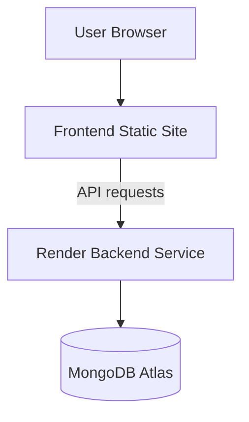

# Deployment Architecture

## Purpose

Describe how Dog Mitra is deployed today and how the frontend and backend relate in production.

## Scope

Deployment topology, environment boundaries, and runtime responsibilities.

## Current Deployment Model

- Backend is deployed as a Render web service
- Frontend is deployed separately as a static site
- Frontend requests must target the backend origin or a configured API base URL
- MongoDB Atlas is the persistent datastore

## Diagram

## Related Documentation

- [System Overview](./system-overview.md)
- [Backend Deployment](../backend/docs/deployment.md)
- [Frontend Deployment](../frontend/docs/deployment.md)

## Last Updated

2026-07-09

