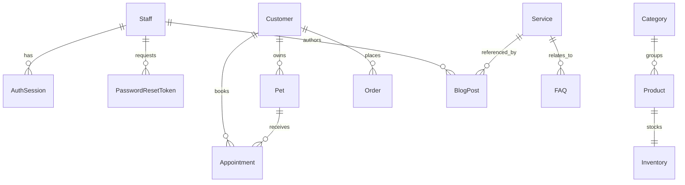

# ER Diagram

## Purpose

Show the major persisted entities and relationships at a project level.

## Scope

Based on the current backend data model.

## Related Documentation

- [Backend Database](../backend/docs/database.md)
- [Backend API Reference](../backend/docs/api-reference.md)

## Last Updated

2026-07-09

