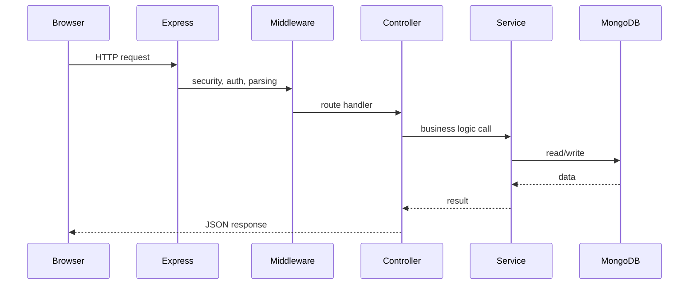
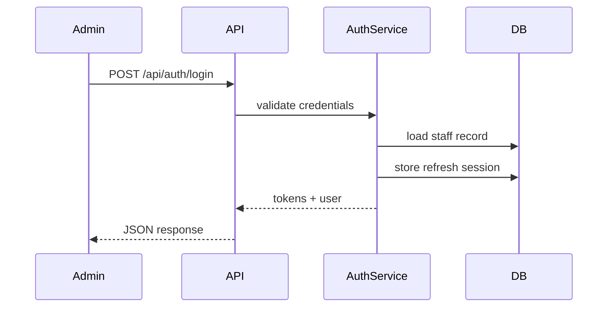

# Sequence Diagrams

## Purpose

Provide common runtime flows in one place for technical onboarding.

## Request Flow

## Authentication Flow

## Related Documentation

- [User Flows](./user-flows.md)
- [Admin Flows](./admin-flows.md)
- [Backend Authentication](../backend/docs/authentication.md)

## Last Updated

2026-07-09

