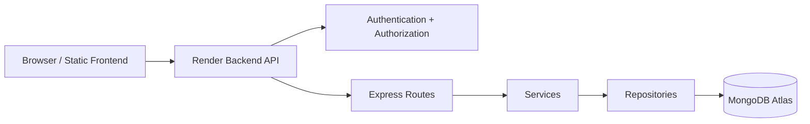

# System Overview

## Purpose

Dog Mitra is a veterinary clinic platform for public customer interaction, clinic operations, content publishing, appointment handling, and administrative management.

## Scope

This document describes the project at a system level. It is independent of implementation details and should be used as the starting point for new contributors.

## Technology Stack

- Frontend: static HTML, CSS, and JavaScript in the repository root
- Backend: Node.js, Express, Mongoose
- Database: MongoDB Atlas
- Authentication: JWT with hashed refresh-session storage
- Hosting: Render

## Repository Structure

```text
Dog-Mitra/
├── README.md
├── architecture/
├── backend/
└── frontend/ (not present in the current repository)
```

## High-Level Architecture



## Related Documentation

- [Deployment Architecture](./deployment-architecture.md)
- [User Flows](./user-flows.md)
- [Admin Flows](./admin-flows.md)
- [Sequence Diagrams](./sequence-diagrams.md)
- [ER Diagram](./er-diagram.md)
- [Integrations](./integrations.md)
- [Roadmap](./roadmap.md)

## Last Updated

2026-07-09

