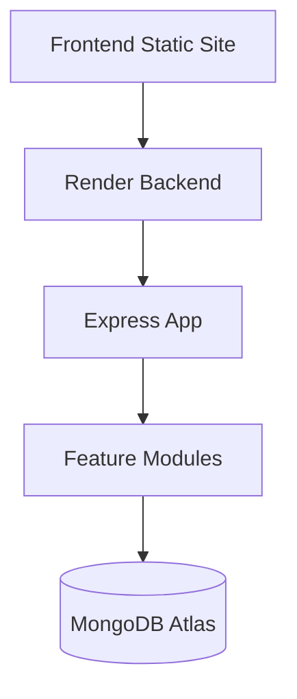
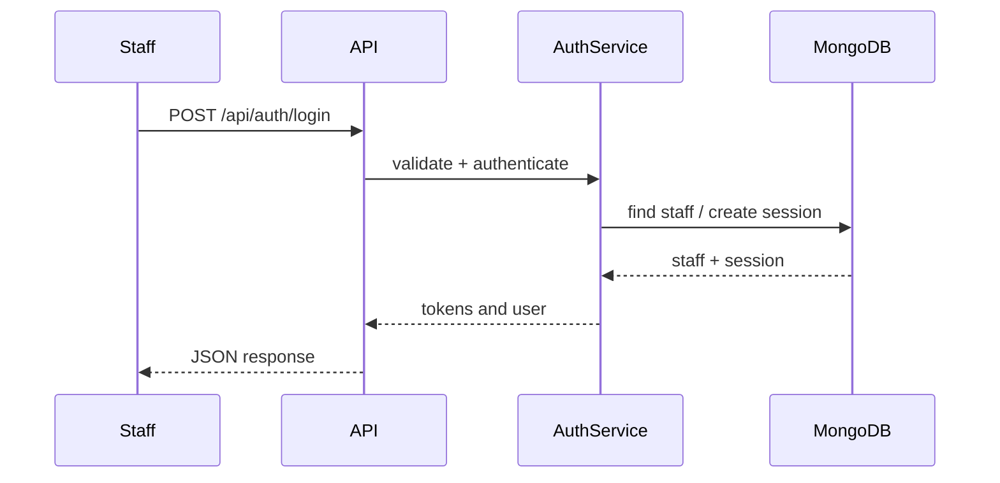
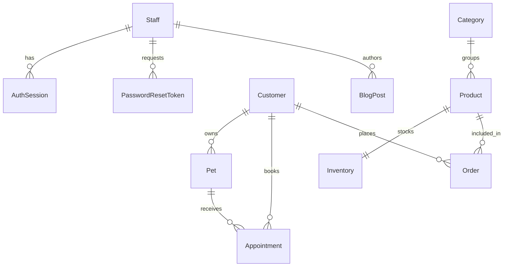

# Architecture and Developer Guide

## System Architecture

## Authentication Flow

## Database Relationship Diagram

## How to Add a New Module

1. Create a Mongoose model under `backend/models/`.
2. Export it from `backend/models/index.js`.
3. Add repository/service/controller logic if the module needs custom behavior.
4. Register a route in `backend/src/routes/index.js` or a dedicated router.
5. Add OpenAPI entries in `backend/src/openapi.js`.
6. Document the module in `backend/docs/database-schema.md` and `backend/docs/api-reference.md`.

## How to Add a New API

1. Add validation in the controller.
2. Keep business logic in the service layer.
3. Keep Mongo access inside the repository layer when needed.
4. Register the route.
5. Add documentation and tests.

## Coding Conventions

- Use CommonJS modules
- Keep controllers thin
- Keep services focused on business rules
- Keep repositories focused on data access
- Prefer explicit validation before persistence

## Folder Conventions

- `models/` for MongoDB schemas
- `src/modules/` for feature-centric code
- `src/routes/` for Express routing
- `src/utils/` for shared helpers

## Naming Conventions

- Models use singular PascalCase
- Route files use dotted lowercase names
- Service and controller objects export descriptive names

