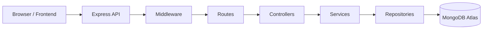
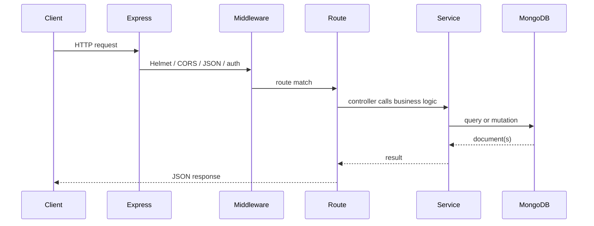

# System Overview

Dog Mitra is a veterinary clinic platform for clinic operations, appointments, customer records, product management, public content, and admin-controlled settings.

## Purpose

The backend powers:

- Authentication and role-based access for staff
- CRUD APIs for clinic, commerce, and CMS data
- Public data delivery for the frontend website
- MongoDB persistence through Mongoose models
- Production deployment on Render

## High-Level Architecture



## Backend Responsibilities

- Validate and authenticate requests
- Enforce role-based access
- Handle CRUD operations through reusable modules
- Serve public content for the frontend
- Seed initial admin and singleton settings data
- Expose health and documentation endpoints

## Frontend Responsibilities

- Render the public website
- Call backend APIs using the configured API base URL
- Display admin login and content editors
- Submit settings, CMS, and CRUD updates to the backend

## MongoDB Responsibilities

- Persist staff, customers, pets, appointments, products, categories, inventory, orders, testimonials, gallery items, services, blog posts, FAQs, contact information, site settings, auth sessions, and password reset tokens
- Enforce schema validation, indexes, and TTL cleanup where defined

## Render Deployment

- Backend is deployed as a Render web service
- Frontend is deployed separately as a Render static site
- The frontend must call the backend using the backend base URL or configured `API_BASE_URL`

## Folder Structure

```text
backend/
├── config/
├── docs/
├── models/
├── src/
│   ├── config/
│   ├── controllers/
│   ├── middlewares/
│   ├── modules/
│   ├── repositories/
│   ├── routes/
│   ├── services/
│   └── utils/
├── package.json
└── README.md
```

### Folder Purposes

- `backend/config/` - MongoDB connection bootstrap
- `backend/docs/` - technical documentation
- `backend/models/` - Mongoose schemas and model definitions
- `backend/src/config/` - environment loading and runtime configuration
- `backend/src/controllers/` - thin request controllers
- `backend/src/middlewares/` - auth and error handling
- `backend/src/modules/` - feature modules such as auth and settings
- `backend/src/repositories/` - model access abstraction
- `backend/src/routes/` - route registration
- `backend/src/services/` - business logic
- `backend/src/utils/` - shared helpers

## Request Lifecycle



## Startup Sequence

1. Environment variables are loaded by `backend/src/config/env.js`.
2. MongoDB connection is established by `backend/config/mongoose.js`.
3. The active database name is logged.
4. The initial admin is seeded if `SUPER_ADMIN_*` values are present.
5. Singleton settings are seeded.
6. Express application middleware and routes are registered.
7. The server starts listening on `PORT`.
8. Shutdown hooks close MongoDB cleanly on `SIGINT` and `SIGTERM`.

